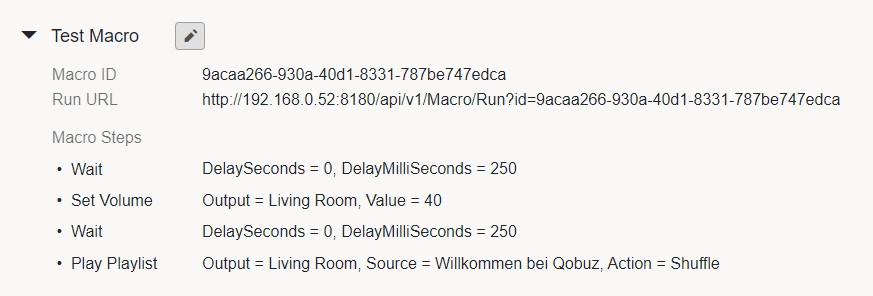
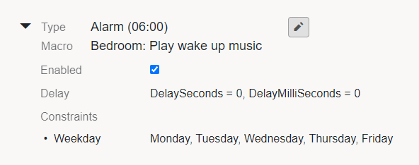
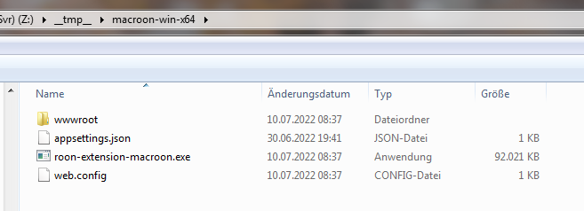
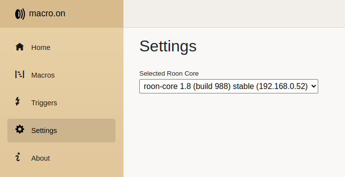
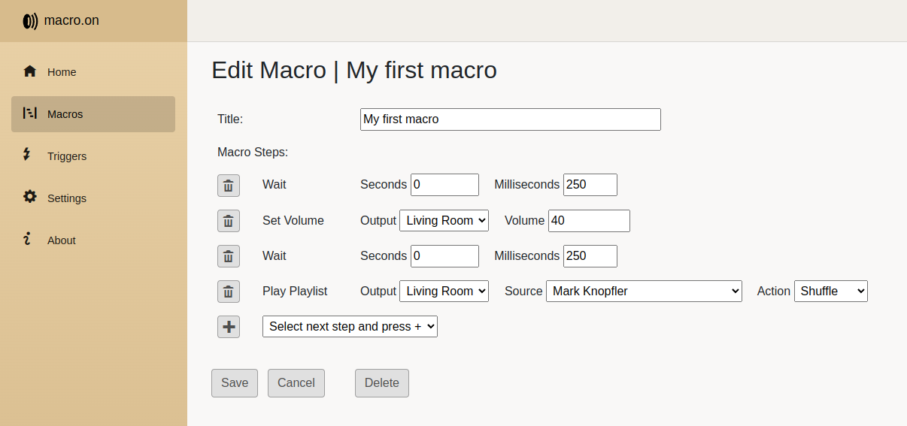
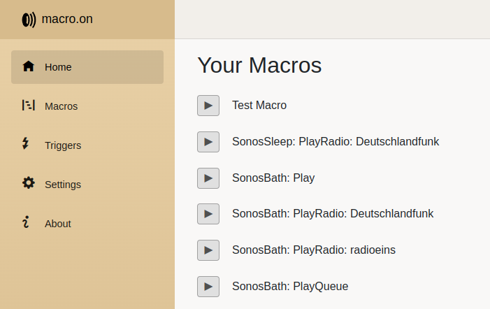

# Roon Extension: macro.on

**macro.on** lets you define macros for your Roon music player. A macro is a sequence of macro steps, for example:
set volume, play internet radio station, pause playback, and so on...

A macro can be executed manually by using the **macro.on** web interface or by using the **macro.on** Android app.
You can also run macros by sending http GET requests, this way you can run macros from any other software that is capable of
sending http GET requests.

Furthermore, macros can be run automatically by using triggers. Examples for triggers are: a certain point in time (alarm clock),
a Roon endpoint appears (autoplay after power on), and so on...

You can assign constraints to a trigger to restrict the execution of a macro. A simple example would be an alarm clock that runs
at 6am in the morning, but only on Mondays through Fridays. A more advanced example would be an autoplay functionality with
different audio sources played at different times of day (news radio station in the morning, music playlist in the evening).

### Macros

A macro is a sequence of macro steps, executed one after the other. Each macro has a unique ID. You will need the ID if you want
to send an http GET request to run a macro (Run URL). As a test, just copy the 'Run URL' into the address bar of your browser and
press enter.

Example:

#### Macro Steps

Currently, the following macro steps are available:

- **Set Volume**    
  Sets the volume of an output, only available for outputs with absolute volume values.   
  Parameters:   
  - *Output*: The output for which the volume is to be set.   
  - *Volume*: The volume value, something valid between min and max volume.
- **Play**   
  Presses the play button of an output (or the associated zone), if play is possible.
  No source is selected, just plays what is currently loaded into the output/zone.   
  Parameters:   
  - *Output*: The output for which the play button is to be pressed.
- **Play Queue**   
  Plays the current queue of an output/zone, if there is something already loaded into the queue.   
  Parameters:   
  - *Output*: The output for which the current queue should be played.
- **Play Radio**   
  Plays an internet radio station on the specified output/zone.   
  Parameters:   
  - *Output*: The output for which the radio station should be played.   
  - *Source*: The name of the radio station.
- **Play Playlist**   
  Plays a playlist on the specified output/zone.   
  Parameters:   
  - *Output*: The output for which the playlist should be played.   
  - *Source*: The name of the playlist.   
  - *Action*: The action to perform (Shuffle, Play Now, ...)
- **Pause**   
  Pauses the playback of the specified output/zone.   
  Parameters:   
  - *Output*: The output for which playback should be paused.
- **Stop**   
  Stops the playback of the specified output/zone.   
  Parameters:   
  - *Output*: The output for which playback should be stopped.
- **Wait**   
  Waits for the specified period of time.   
  Parameters:   
  - *DelaySeconds*: Seconds to wait.   
  - *DelayMilliSeconds*: Milliseconds to wait.

### Triggers

A trigger is an association of a trigger type with a macro to be executed. Furthermore, constraints can be assigned to a trigger
to restrict the execution of a macro. Multiple constraints are combined using the logical *and* operator.

Example:   

#### Trigger Types

Currently, the following trigger types are available:

- **Alarm**   
  An alarm trigger is executed at a specified time.   
  Parameters:   
  - *Time*: A time between 00:00 and 23:59.
- **Autoplay**   
  An autoplay trigger is executed as soon as a Roon output (endpoint) gets available (e.g. after powering on some device).   
  Parameters:   
  - *Output*: The output to be monitored for availability.
- **IP Detection**   
  An IP detection trigger is executed as soon as one can ping an IP address successfully. The software tries to ping the IP every 5 seconds.
  If an IP is pingable, it is assumed 'online', otherwise it is assumed 'offline'.   
  Parameters:   
  - *IP Address*: The IP address to ping.
  - *Min Seconds Online*: Minimum time period in seconds during which the state 'online' is held. After the last successful ping, the software
    waits this time period before switching to 'offline' (to prevent switching to 'offline' just because one single ping fails).  
  - *Min Seconds Offline*: Minimum time period in seconds during which the state 'offline' is held.

Parameters common to all trigger types:   
- *Macro*: The macro to execute when the trigger conditions are met and the trigger is executed.   
- *Delay*: Waits the specified time period before executing the macro.

#### Trigger Constraints

Currently, the following trigger constraints are available:

- **Weekday**   
  Executes the trigger only on the specified days of week.   
  Parameters:   
  - *Weekday*: Monday, Tuesday, ...
- **Timespan**   
  Executes the trigger only in the specified time period.   
  Parameters:   
  - *After*: A time between 00:00 and 23:59.
  - *Before*: A time between 00:00 and 23:59.
- **Output Online**   
  Executes the trigger only if the specified output is online (output is available as Roon endpoint).   
  Parameters:   
  - *Output*: The output which must be online.

## Installation

Installation steps:

- Please download the application (zip archive) matching your target platform from here:   
  [https://bsc101.eu/downloads/macroon/roon-extension-macroon/](https://bsc101.eu/downloads/macroon/roon-extension-macroon/)   
  Let me know if your target platform is missing.
- Unzip the archive to some directory below your user directory. The application needs write access to the working directory
  (the directory from where the application is started) to be able to save configuration files.
- Open a terminal/command line and change directory to the directory with the extracted files. The content of this directory
  should typically look like this:   
  
- The file *roon-extension-macroon[.exe]* is the executable file. Just run it from command line.
- **macro.on** comes with a web interface. You can reach it at the following address:   
  http://*localhost*:8180/ or http://*ip_address_of_the_machine_running_macroon*:8180/
- Go to the Settings page and select your Roon core:   
  
- Open a Roon remote and go to Settings/Extensions. Enable the **macro.on** extension.
- Go back to the **macro.on** web interface and start creating macros and triggers:   
  
- Run your macros manually directly from the Home page:   
  

---

mailto: dev@bsc101.eu
